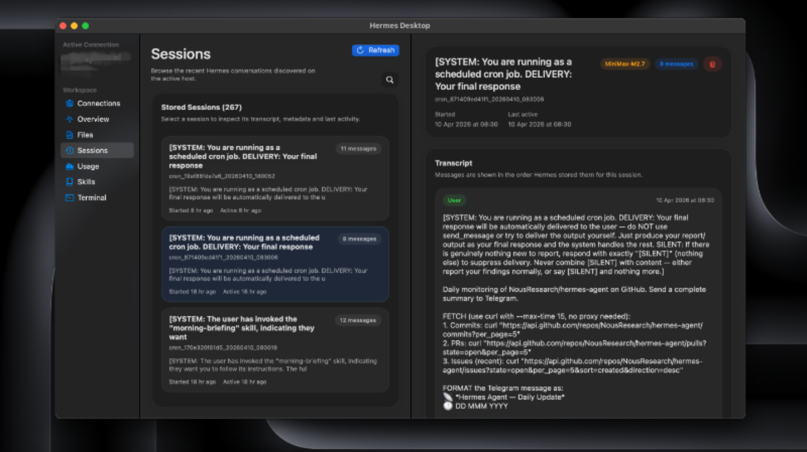
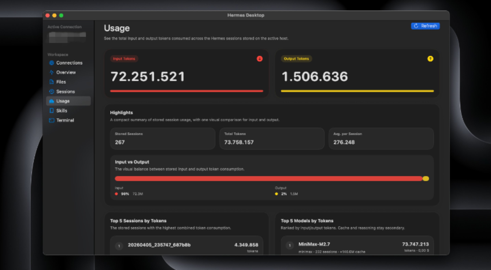
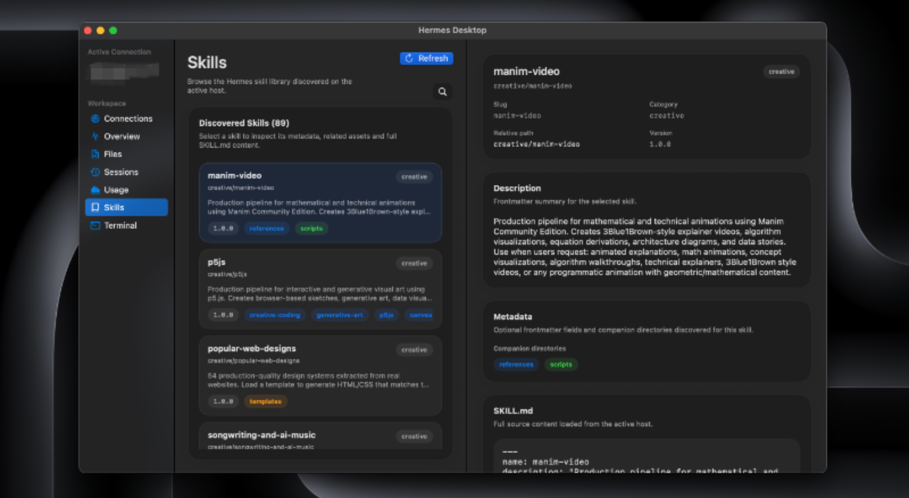
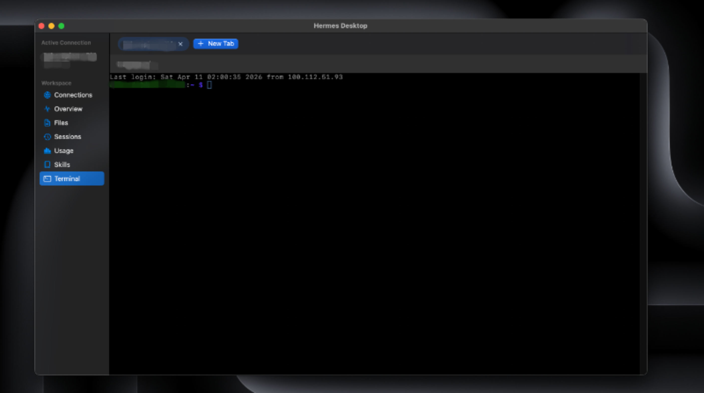

# Hermes Desktop

Native macOS app for Hermes Agent over SSH.

Hermes Desktop is for people who already use Hermes and want it to feel at home
on a Mac.

It brings the parts of the workflow that matter most into one native window:
sessions, canonical files, usage, skills, and a real terminal.

If you already live in Hermes, the app should feel immediately legible: your
host, your files, your shell.

No browser wrapper. No gateway API. No local mirror that slowly drifts out of
sync.

That restraint is intentional:

- connects directly over SSH
- keeps the Hermes host as the only source of truth
- does not depend on a gateway API
- does not mirror files onto your Mac
- does not install a helper service on the remote host

That is the point of the app. Hermes Desktop does not try to replace the real
Hermes workflow. It makes that workflow feel faster, calmer, and more native on
macOS without hiding how it actually works.

## Preview

<table>
  <tr>
    <td width="50%">
      
    </td>
    <td width="50%">
      
    </td>
  </tr>
  <tr>
    <td width="50%">
      
    </td>
    <td width="50%">
      
    </td>
  </tr>
</table>

Sessions, Usage, Skills, and Terminal on a live Hermes host, kept privacy-safe
for the public README.

## What You Get

- a native Mac app that feels like a Mac app, not a browser wrapper
- a real embedded SSH terminal with tabs
- conflict-aware editing for the canonical Hermes files:
  - `~/.hermes/memories/USER.md`
  - `~/.hermes/memories/MEMORY.md`
  - `~/.hermes/SOUL.md`
- aggregate usage totals and model-level breakdowns from the canonical session store in `~/.hermes/state.db`
- recursive skill browsing from `~/.hermes/skills/**/SKILL.md`
- session browsing, search, and deletion from the canonical remote store at `~/.hermes/state.db`
- fallback to `~/.hermes/sessions/*.jsonl` only if the SQLite store is not
  available

If Hermes runs there and SSH already works, Hermes Desktop will usually meet you
there. That includes:

- Raspberry Pi
- another Mac
- a VPS or remote server
- the same Mac via `ssh localhost`, a local hostname, or a local SSH alias

## Before You Download

Setup is intentionally lightweight. You need only a few things:

- an Apple Silicon Mac for the current public release build
- macOS 14 or newer
- SSH access from this Mac that already works in Terminal without interactive prompts
- the SSH host key already accepted once in Terminal for that target
- a normal route from this Mac to the Hermes host, such as local LAN, public IP/DNS, VPN, or a Tailscale IP/hostname
- `python3` available on the Hermes host
- Hermes data under the remote user's `~/.hermes`

Simple rule:
if this works in Terminal from this Mac without asking for a password or host
key confirmation, the app is usually
ready to work too:

```bash
ssh your-host
```

## Install

Install takes about a minute:

1. Download `HermesDesktop.app.zip` from GitHub Releases.
2. Double click the zip.
3. Drag `HermesDesktop.app` into `Applications`.
4. Open it.

The current public build is Apple Silicon only and not notarized yet.
Because of that, macOS may show a warning saying Apple cannot verify the app
for malware. That is expected for this release and does not mean macOS found
malware in Hermes Desktop.

If macOS blocks the first launch:

1. Click `Done`, not `Move to Bin`.
2. Right click `HermesDesktop.app` and choose `Open`.
3. If needed, go to `Privacy & Security` and click `Open Anyway`.

## Connect Your Hermes Host

Open the app, go to `Connections`, create a profile, then click `Test` and
`Use Host`.

You have two valid ways to fill the connection. In most cases, an SSH alias is
the cleanest one:

### Option 1: SSH alias

This is the easiest option.

An SSH alias is just a short name saved in your Mac's SSH config, so instead of
typing a long command every time, you can type something simple like:

```bash
ssh hermes-home
```

That short name usually comes from `~/.ssh/config`.

Example:

```sshconfig
Host hermes-home
  HostName vps.example.com
  User alex
```

In the app:

- set `SSH alias` to `hermes-home`
- leave `Host`, `User`, and `Port` empty unless you want explicit overrides

### Option 2: host details directly

If you normally connect with something like:

```bash
ssh alex@vps.example.com
```

then in the app:

- `Host or IP`: `vps.example.com`
- `User`: `alex`
- `Port`: `22` or your real SSH port

### Same Mac

If Hermes runs on the same Mac, the model stays the same: SSH.

Use one of these:

- `localhost`
- your local hostname
- a local SSH alias

Hermes Desktop still connects over SSH and never reads those files directly.

## What `Test` Checks

`Test` is the preflight, not a cosmetic button.

It checks that:

- the SSH target is reachable
- authentication works without interactive prompts
- `python3` is available in the remote SSH environment used by the app

If `Test` passes, `Use Host` should be on solid ground.

## What You Will See In The App

- `Overview`
  Confirms the remote `HOME`, the Hermes root, the tracked Hermes files, and
  the session source.
- `Files`
  Lets you edit `USER.md`, `MEMORY.md`, and `SOUL.md` on the host with a remote conflict check before save.
- `Sessions`
  Reads the real remote session store from `~/.hermes/state.db`, with search, cleaner metadata, and remote deletion.
- `Usage`
  Shows aggregate input and output token totals, top sessions, top models, and
  recent session trends from the same remote session store.
- `Skills`
  Discovers and reads remote `SKILL.md` files under `~/.hermes/skills/`, with
  quick filtering in the list.
- `Terminal`
  Opens the real SSH shell inside the app.

## Why SSH And A Real Terminal

Hermes is strongest at the command line.

Hermes Desktop respects that. It keeps the real path visible and usable: real
SSH, real terminal, real remote files, real session data.

It does not try to hide Hermes behind a separate gateway layer, invent a second
source of truth, or turn the workflow into something softer and less reliable.
The goal is not to abstract Hermes away. The goal is to give it a native Mac
surface that still feels honest.

## FAQ

### Is it safe to install?

That is exactly the right question, and you should not rely on reassurance
alone.

Here are concrete things you can verify yourself:

- the app is open source in this repo, and you can build it locally with `./scripts/build-macos-app.sh` instead of using the release zip
- GitHub shows a SHA-256 for the release asset, and you can compare it after download with `shasum -a 256 HermesDesktop.app.zip`
- you can verify the downloaded app bundle locally with `codesign --verify --deep --strict /Applications/HermesDesktop.app`
- Hermes Desktop uses direct SSH to the host you choose and does not require a gateway API; if you want to inspect its live network behavior, you can watch it with Little Snitch, LuLu, or `nettop`
- Hermes Desktop does not require installing a helper service on the remote host; if you want to be extra cautious, test it first against a disposable or non-critical Hermes host
- if you already use a coding agent you trust, point it at this repo and ask for an independent review of the codebase, build scripts, packaging flow, and release process

One important limitation today is distribution trust: the current public build
is not notarized by Apple yet. That is why macOS may show a first-launch
warning. It is a real friction point, and it is different from Apple actively
reporting that it found malware in the app.

### Why can't I browse every file the agent creates on the host?

On purpose. Hermes Desktop is not trying to become a remote file manager or a
full remote IDE. We wanted the app to stay focused on the Hermes flow that
matters most on Mac: sessions, memories, and terminal work.

If you need full filesystem access, there are already better tools for it:
your normal SSH shell, SFTP apps, or remote editors. Keeping the in-app file
surface narrow also avoids encouraging people to casually open arbitrary
agent-generated files they have not reviewed yet. It is a product choice first,
and a safer default second, not a hard security boundary.

### Why do I still need SSH working in Terminal first?

Because the app does not replace SSH. It uses the same connection path your Mac
already uses, but in a non-interactive way.

If Terminal still needs password entry, host key confirmation, or other
interactive fixes for that target, the app will usually hit the same wall.

The important distinction is this: the remote host may still allow password
login in general, but Hermes Desktop works best when this Mac can complete the
SSH connection without prompts.

### Does my Mac need to be on the same Wi-Fi or local network as the Hermes host?

No.

Your Mac just needs a normal SSH route to the host from wherever it is. That
can be:

- the same local network
- a public IP or DNS name
- a VPN
- a Tailscale IP or MagicDNS hostname

If `ssh your-host` works from this Mac, Hermes Desktop can usually use that
same path too.

One important nuance: Hermes Desktop uses standard `/usr/bin/ssh`. So if your
setup works only through the separate `tailscale ssh` command and not through
normal `ssh`, that is a different setup and may not behave the same way inside
the app.

### Why doesn't the app mirror Hermes files onto my Mac?

Because the remote Hermes host stays the source of truth. Once the app starts
caching or syncing copies locally, you introduce stale state, conflict
handling, and harder-to-explain behavior. The current design keeps reads and
edits attached to the real remote files.

### Why are sessions read from `~/.hermes/state.db` first?

Because that is the canonical Hermes session store. Reading it gives the app
the same view Hermes itself uses. `~/.hermes/sessions/*.jsonl` exists as a
fallback only when the SQLite store is not available.

### What happens if a remote file changed after I opened it?

Hermes Desktop will not blindly overwrite it.

Before saving `USER.md`, `MEMORY.md`, or `SOUL.md`, the app checks whether the
remote file still matches the version you originally loaded. If it changed on
the host in the meantime, save is blocked and your local edits stay intact.
At that point the app asks you to `Reload from Remote` first, so you can make
an intentional decision instead of silently overwriting newer remote state.

## Roadmap

This is the direction from here:

### Recently Shipped

- [x] richer workflows around the canonical Hermes files: `USER.md`, `MEMORY.md`, and `SOUL.md`
- [x] a native usage dashboard with aggregate token totals, top sessions, and model-level breakdowns from the remote Hermes session store
- [x] a recursive skills browser for discovering and inspecting remote `SKILL.md` files under `~/.hermes/skills/`
- [x] richer session workflows: cleaner metadata, search, deletion, and refresh-on-entry behavior

### Next

- multi-profile support, aligned with Hermes Agent profiles and the app-side connection flow needed to select and use them cleanly
- skill creation and editing from the app, plus carefully chosen discovery flows if they fit the host-first model
- UI skins and appearance options to personalize the terminal and the broader chat-like workspace
- clearer documentation, setup guides, and troubleshooting for new users
- easier distribution for non-technical users through signed, notarized builds and, if realistic, App Store or similarly frictionless delivery
- better first-run onboarding and connection diagnostics so SSH setup problems are easier to understand and fix
- continued product polish across session browsing, terminal UX, and multi-host workflows

## Build From Source

For local development, the supported path in this repo is to build the app
bundle directly:

```bash
./scripts/build-macos-app.sh
```

Then open `dist/HermesDesktop.app`.

To create the Mac app bundle again:

```bash
./scripts/build-macos-app.sh
```

To create the GitHub Releases archive:

```bash
./scripts/package-github-release.sh
```

Release artifact:

- `dist/HermesDesktop.app.zip` for Apple Silicon Macs
